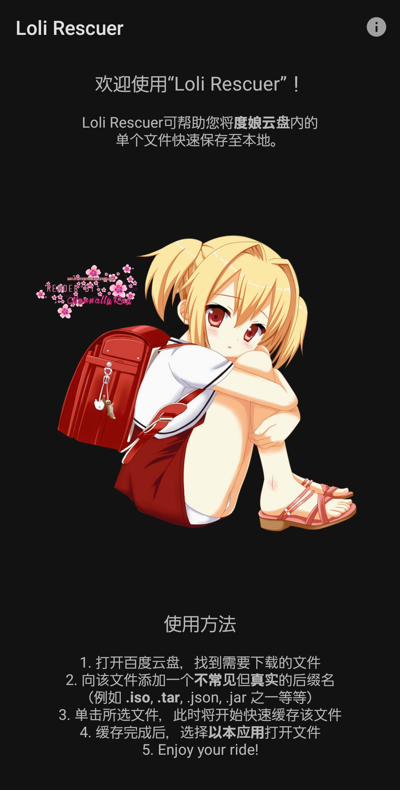
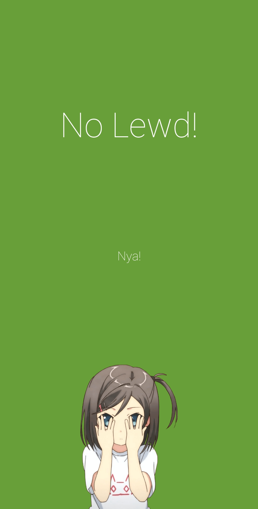
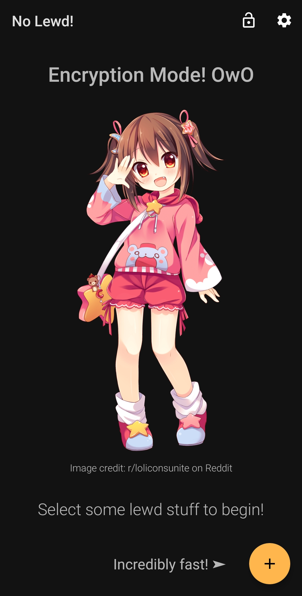
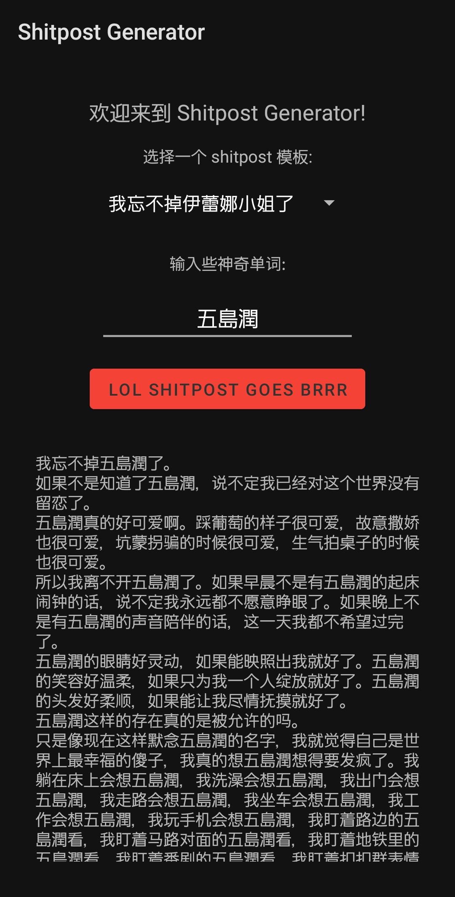

# My Android Application Collection

## What's this? / 这是什么？

This repository contains some of the weird little Android applications I've built. 
They're not necessarily complex by any means, and the only reason I built them is because, well, it's fun to work on creative projects, isn't it. 

You're welcome to test anything out, but please do not repost/redistribute/modify/etc. any of them without my prior consent. 
Also, use them at your own risk! I won't be held responsible for any damage they might cause or anything else that might happen. 
But you're still welcome to open an issue if you find any potential bugs, or contact me directly in person if you know me irl. 

The application descriptions will only be written in languages that the application itself supports, so please don't ask me "where's the description in {language-name} language?"; if you can't read the description, you probably won't be able to use the application smoothly anyway. 

Have fun browsing! 

该仓库包含一些我制作的奇奇怪怪的Android应用程序。
这些应用程序不一定有多复杂，会开发它们也只是单纯因为我比较喜欢开脑洞而已。

如果有喜欢的应用的话欢迎来尝尝鲜，不过请勿在未获得我的许可的情况下就擅自对这些内容进行转发、散播、和/或改动等等。
还有就是，我是不会负任何责任的！即便因为这些应用程序而造成了任何损失或其他后果，都请自行进行承担。
不过如果你发现了bug之类的话，还是可以开个issue讨论一下的，或者如果你在现实中认识我的话也可以直接来找我聊聊。

除了应用本身就支持的语言之外，我不会以其他语言来撰写某应用程序的说明内容，所以请不要问我“{语言名}语的说明在哪里？”；如果你看不懂说明内容的话，估计你也没法子用明白对应的应用。

浏览愉快！

---

## Loli Rescuer

该应用可帮助你（相对）快速地下载百度网盘内的单个文件。

遵循应用内的指示操作即可。

## No Lewd!

This application is designed to quickly and efficiently encrypt/decrypt images. 
It utilizes a rolling algorithm for image manipulation with a key and an increment value, which makes it practically invulnerable against regulations. 

The encrypted images, if sent through some media, have to be in their original quality - though I have updated the algorithm so that as long as the resolution of the image does not change, even after compression, some information should still be recoverable. 

该应用可帮助你快速、高效地加密、解密涩图（或者其他图片）。
滚动式的加密算法（包括一个密钥及一个加算值）使它在对抗监管（河蟹）时几乎无敌。

如果要通过某些平台发送加密图片的话，必须以原图质量发送。不过我最近更新了算法，所以现在即便不以原图发送，只要图片本身的分辨率不变化的话，还是可以恢复部分内容的。

## Shitpost Generator

顾名思义，该应用是用来一键生成shitpost（主要是魔怔话）的。

目前内置了一些模板……试试就知道了，效果 绝 对 拔 群 。

---

## Epilogue / 结语

This is as far as we're at now. 

Maybe I'll make some more applications in the future, who knows! 

目前就这么多了。

可能之后还会再做点别的吧，谁知道呢！